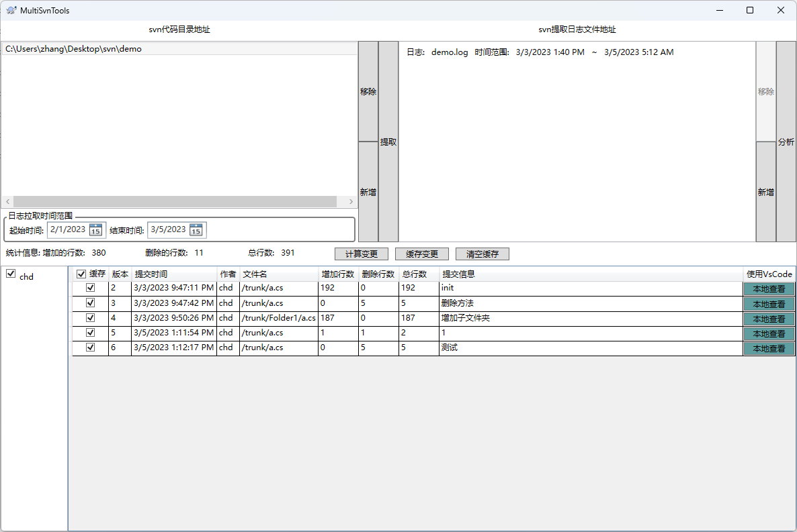

# MultiSvnRepoSummaryTool

对多个svn库合并查看统计信息

- 功能特点

	- 允许选择多个svn库合并查看提交记录
	- 可以自由选择用户并统计提交信息
	- 可以用vscode 查看svn提交记录

- Requirement

	- .Net6
	- 将vs code配置到环境变量中

- 界面截图

- 使用说明

1. 左边新增选择本地的svn目录并选择时间范围，点击提取获取svn日志到右侧列表

2. 右侧列表出现日志后（也可以选择本地已经获取的svn日志导入）点击分析后下方就会显示作者列表与提交记录

3. 点击使用vscode查看功能可以在vs code中打开提交记录查看

4. 点击计算变更, 将利用svn diff功能获取每次提交的变更行数