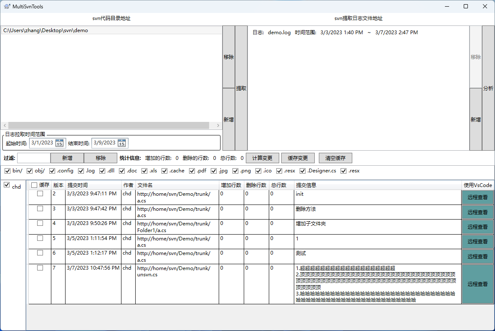

# MultiSvnRepoSummaryTool

对多个svn库合并查看统计信息

- 功能特点

	- 允许选择多个svn库合并查看提交记录
	- 可以自由选择用户并统计提交信息
	- 可以用vscode 查看在线svn提交记录, 也可以将提交记录下载到本地进行离线查看

- Requirement

	- 安装[.Net6运行环境](https://dotnet.microsoft.com/en-us/download/dotnet/6.0)
	- 将vs code配置到环境变量中(即把vscode的路径添加到path中)
	- svn (tortoise工具)需要安装命令行工具

- 界面截图

- 使用说明

1. 左边新增选择本地的svn目录并选择时间范围，点击提取获取svn日志到右侧列表

2. 右侧列表出现日志后（也可以选择本地已经获取的svn日志导入）点击分析后下方就会显示作者列表与提交记录

3. 点击使用vscode查看功能可以在vs code中打开提交记录查看

4. 点击计算变更, 将利用svn diff功能获取每次提交的变更行数

5. 选择需要缓存的文件, 点击缓存到本地进行查看

- 开源声明

	+ 受 [dingguotu/SVNTool](https://github.com/dingguotu/SVNTool) 项目启发（使用了部分代码）。 使用wpf, CommunityToolkit.mvvm, Behavior.wpf , nlog实现的多svn库/异步/多线程版本

	+ chatgpt提供了一些示例